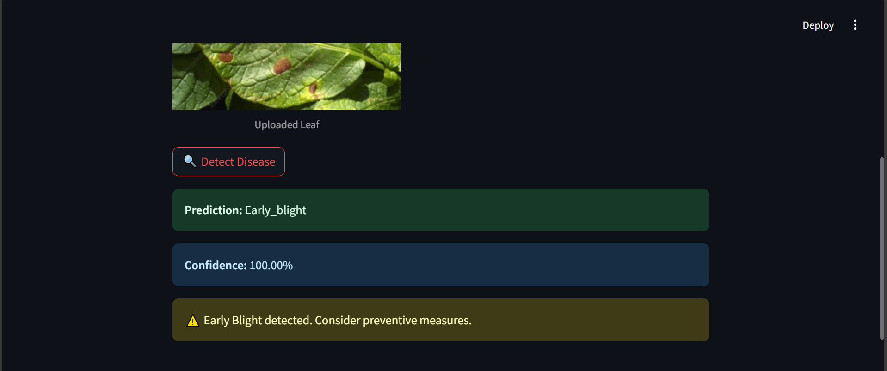

# Potato Disease Detection

## Problem statement
Difficult to identifying potato leaf diseases early due to visual similarity 
and external factors influence. Due to this crop loss potential yield, by
not taking decisions on time.

---

## Overview:
A compact, end‑to‑end system to classify potato leaf images into Early Blight, 
Late Blight, or Healthy, with two simple training paths (tf.data on a single 
Dataset folder or ImageDataGenerator on dset splits) and three deployment 
options (local FastAPI, TF‑Serving bridge, and a lightweight Google Cloud 
Function), plus a Streamlit demo for quick validation.


## Tech stack

**Modeling:** TensorFlow 2.x, Keras, NumPy, Matplotlib, tf.data, ImageDataGenerator.

**Serving:** FastAPI, Uvicorn, TensorFlow Serving (REST), Google Cloud Functions (TF and TFLite optional), Streamlit UI.

**Cloud:** Google Cloud Storage for model artifacts.


## Project structure

**api/**

- **main.py:** FastAPI app that loads a saved Keras model and predicts from uploaded images.

- **main-tf-serving.py:** FastAPI app that calls a TensorFlow Serving REST endpoint.


**gcp/**

- **main.py:** Google Cloud Function entry (predict) that lazily downloads a Keras .h5 from GCS and runs inference.


**ui/**

- **streamlit_ui.py:** Streamlit app to upload an image and run local inference using a saved model.


**models/**

- **saved_models/1/:** TensorFlow SavedModel version directory expected by UI/API when running locally.

- **potatoes.h5 or potato-model.h5:** Keras H5 model for GCF or alternate deployments.


**training/**

- **Potato_Desease_Detection.ipynb:** tf.data pipeline and simple CNN training
   on Dataset.

- **image_data_generator.ipynb:** Keras ImageDataGenerator training on 
   dset/train, dset/val, dset/test.


**Dataset/:** For image_dataset

**dset/:**
- **train/, val/, test/:** Explicit splits for ImageDataGenerator workflow.


## Training the Model

1. Download the data from [kaggle](https://www.kaggle.com/arjuntejaswi/plant-village).
2. Only keep folders related to Potatoes.
3. Run Jupyter Notebook in Browser.

```bash
jupyter notebook
```

4. Open `training/potato-disease-training.ipynb` in Jupyter Notebook.
5. In cell #2, update the path to dataset.
6. Run all the Cells one by one.
7. Copy the model generated and save it with the version number in the `models` folder.


---

## Setup

### Setup for Python and virtualenv:

1. Install Python ([Setup instructions](https://wiki.python.org/moin/BeginnersGuide))

2. Install Python packages

```
pip3 install -r training/requirements.txt
pip3 install -r requirements.txt
```

3. Install Tensorflow Serving (Optional) ([Setup instructions](https://www.tensorflow.org/tfx/serving/setup))


## Running for Streamlit UI

Run streamlite UI simply to user interaction, without runnig API's server.

```bash
# To run streamlit ui
streamlit run streamlit_ui.py
```

### Streamlit
**Designed for quick disease detection for farmers.**

**Provides a simple Streamlt Ui for inputs and shows the predicted crop.**





**Choose potato leaf image -> Click on Detect Disease -> Quikly get disease or 
Healthy leaf.**


---


## Running the API

### Using FastAPI

1. Get inside `api` folder

```bash
cd api
```

2. Run the FastAPI Server using uvicorn

```bash
uvicorn main:app --reload --host 127.0.0.1
```

3. Your API is now running at `127.0.0.1:8000`


### Using FastAPI & TF Serve

1. Get inside `api` folder

```bash
cd api
```

2. Copy the `models.config.example` as `models.config` and update the paths in file.
3. Run the TF Serve (Update config file path below)

```bash
docker run -t --rm -p 8501:8501 -v C:/Code/potato-disease-classification:/potato-disease-classification tensorflow/serving --rest_api_port=8501 --model_config_file=/potato-disease-classification/models.config
```

4. Run the FastAPI Server using uvicorn
   For this you can directly run it from your main.py or main-tf-serving.py using pycharm run option (as shown in the video tutorial)
   OR you can run it from command prompt as shown below,

```bash
uvicorn main-tf-serving:app --reload --host 0.0.0.0
```

5. Your API is now running at `0.0.0.0:8000`


## Creating the TF Lite Model

1. Run Jupyter Notebook in Browser.

```bash
jupyter notebook
```

2. Open `training/tf-lite-converter.ipynb` in Jupyter Notebook.
3. In cell #2, update the path to dataset.
4. Run all the Cells one by one.
5. Model would be saved in `tf-lite-models` folder.


## Deploying the TF Lite on GCP

1. Create a [GCP account](https://console.cloud.google.com/freetrial/signup/tos?_ga=2.25841725.1677013893.1627213171-706917375.1627193643&_gac=1.124122488.1627227734.Cj0KCQjwl_SHBhCQARIsAFIFRVVUZFV7wUg-DVxSlsnlIwSGWxib-owC-s9k6rjWVaF4y7kp1aUv5eQaAj2kEALw_wcB).
2. Create a [Project on GCP](https://cloud.google.com/appengine/docs/standard/nodejs/building-app/creating-project) (Keep note of the project id).
3. Create a [GCP bucket](https://console.cloud.google.com/storage/browser/).
4. Upload the potatoes.h5 model in the bucket in the path `models/potatos.h5`.
5. Install Google Cloud SDK ([Setup instructions](https://cloud.google.com/sdk/docs/quickstarts)).
6. Authenticate with Google Cloud SDK.

```bash
gcloud auth login
```

7. Run the deployment script.

```bash
cd gcp
gcloud functions deploy predict_lite --runtime python38 --trigger-http --memory 512 --project project_id
```

8. Your model is now deployed.
9. Use Postman to test the GCF using the [Trigger URL](https://cloud.google.com/functions/docs/calling/http).

Inspiration: https://cloud.google.com/blog/products/ai-machine-learning/how-to-serve-deep-learning-models-using-tensorflow-2-0-with-cloud-functions


## Deploying the TF Model (.h5) on GCP

1. Create a [GCP account](https://console.cloud.google.com/freetrial/signup/tos?_ga=2.25841725.1677013893.1627213171-706917375.1627193643&_gac=1.124122488.1627227734.Cj0KCQjwl_SHBhCQARIsAFIFRVVUZFV7wUg-DVxSlsnlIwSGWxib-owC-s9k6rjWVaF4y7kp1aUv5eQaAj2kEALw_wcB).
2. Create a [Project on GCP](https://cloud.google.com/appengine/docs/standard/nodejs/building-app/creating-project) (Keep note of the project id).
3. Create a [GCP bucket](https://console.cloud.google.com/storage/browser/).
4. Upload the tf .h5 model generate in the bucket in the path `models/potato-model.h5`.
5. Install Google Cloud SDK ([Setup instructions](https://cloud.google.com/sdk/docs/quickstarts)).
6. Authenticate with Google Cloud SDK.

```bash
gcloud auth login
```

7. Run the deployment script.

```bash
cd gcp
gcloud functions deploy predict --runtime python38 --trigger-http --memory 512 --project project_id
```

8. Your model is now deployed.
9. Use Postman to test the GCF using the [Trigger URL](https://cloud.google.com/functions/docs/calling/http).

Inspiration: https://cloud.google.com/blog/products/ai-machine-learning/how-to-serve-deep-learning-models-using-tensorflow-2-0-with-cloud-functions


---

## API examples
You can test the FastAPI potato disease prediction service using **Postman**.

### Endpoint: `/potato-disease-predict`

- **Method:** POST  
- **URL:** `http://127.0.0.1:8000/potato-disease-predict`  
- **Headers:**  
  - `accept: application/json`  
- **Body:**  
  - Select **form-data**  
  - Add a key named `file` (type = **File**)  
  - Upload an image file (e.g., `leaf.jpg`), here can take any potato
    leaf image to detect disease.


---


### Result
- **Farmers to upload leaf image for instant disease detection,
   decision-making and reducing potential yield loss.**
- **Farmer can early apply solution on potato crop.**
- **This system will less time and give farmers fast solution.**


---


### Security and cost notes
- Prefer batch size 1 for online inference and lazy‑load models in serverless
(as in GCF) to reduce cold‑start memory load.

- Keep models small for low‑cost TF Serving or GCF; quantize to TFLite for
edge/mobile if required.


### License

**Suggested:** MIT or Apache‑2.0. Add LICENSE to repo root.


